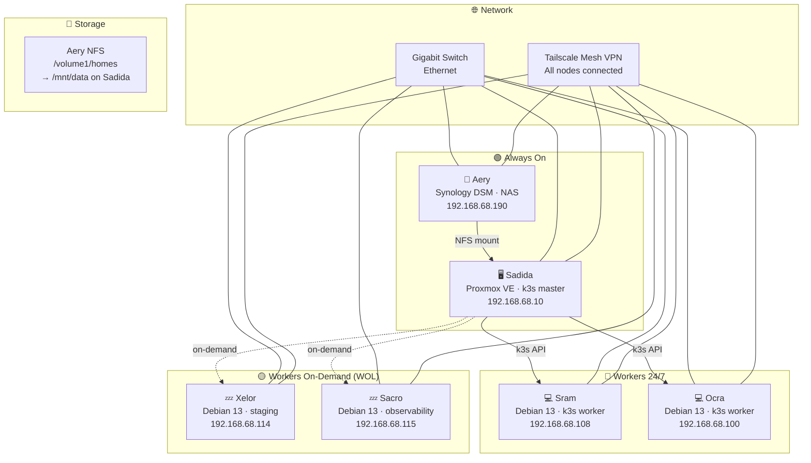
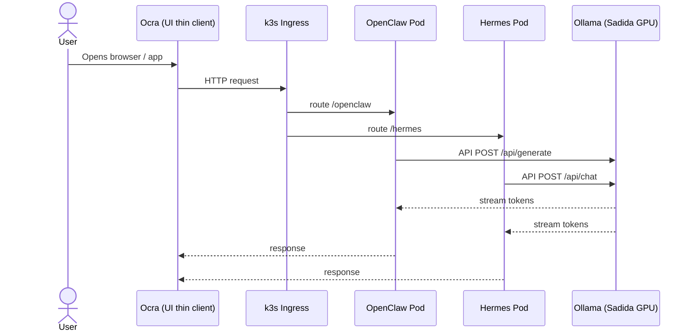
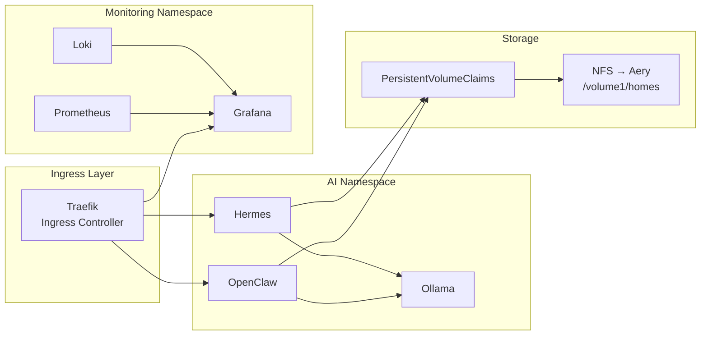
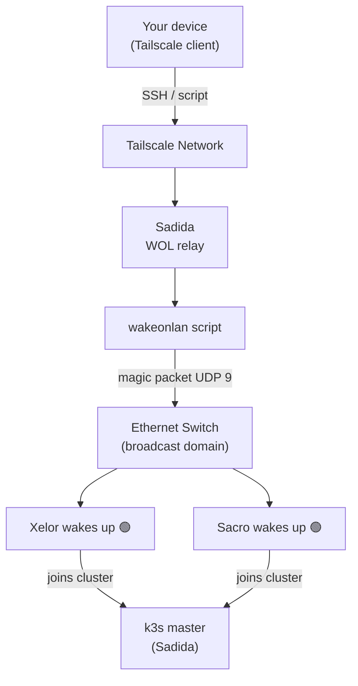

# HomeLab Infrastructure
 
Complete infrastructure for a 6-node home cluster based on **k3s**, **Proxmox VE**, **Tailscale** and **Wake-on-LAN**, with support for local AI models via GPU.
 
---
 
## Table of Contents
 
- [Nodes and Roles](#nodes-and-roles)
- [Network Architecture](#network-architecture)
- [Diagrams](#diagrams)
- [Prerequisites](#prerequisites)
- [Quick Start](#quick-start)
- [Daily Usage](#daily-usage)
- [Service Stack](#service-stack)
- [Project Structure](#project-structure)
- [Security Notes](#security-notes)
---
 
## Nodes and Roles
 
| Node | Base OS | Role | Availability |
|------|---------|------|--------------|
| **Sadida** | Proxmox VE 8 (Debian 13 Trixie kernel) | Hypervisor · k3s control-plane · GPU passthrough for Ollama | 24/7 |
| **Aery** | Synology DSM | NAS · NFS persistent volumes (`/volume1/homes`) · Backup | 24/7 |
| **Sram** | Debian 13 Trixie (bare metal) | k3s worker · development environments | 24/7 |
| **Ocra** | Debian 13 Trixie (bare metal) | k3s worker · AI thin client (UI only) | 24/7 |
| **Xelor** | Debian 13 Trixie (bare metal) | k3s worker on-demand · staging · CI/CD | On-demand |
| **Sacro** | Debian 13 Trixie (bare metal) | k3s worker on-demand · observability (Grafana / Loki) | On-demand |
 
### Node IPs
 
| Node | IP | Role |
|------|----|------|
| Sadida (Proxmox) | `192.168.68.10` | k3s control-plane |
| Aery (Synology) | `192.168.68.190` | NFS server |
| Ocra | `192.168.68.100` | k3s worker |
| Sram | `192.168.68.108` | k3s worker |
| Xelor | `192.168.68.114` | k3s worker (on-demand) |
| Sacro | `192.168.68.115` | k3s worker (on-demand) |
 
### k3s Cluster
 
The k3s control-plane runs directly on Sadida (Proxmox host), not inside a VM. Workers are bare-metal Debian 13 nodes joined via Tailscale IP for network resilience.
 
```
k3s v1.35.5+k3s1
Subnet: 192.168.68.0/24
```
 
---
 
## Network Architecture
 
```
Internet
   │
   └── Home Router (192.168.68.1)
          │
          └── Gigabit Ethernet Switch
                 ├── Sadida     192.168.68.10   (Proxmox + k3s master)
                 ├── Aery       192.168.68.190  (Synology NAS)
                 ├── Ocra       192.168.68.100  (k3s worker)
                 ├── Sram       192.168.68.108  (k3s worker)
                 ├── Xelor      192.168.68.114  (k3s worker, on-demand)
                 └── Sacro      192.168.68.115  (k3s worker, on-demand)
```
 
**Tailscale mesh VPN** runs on all nodes, providing stable addressing independent of local network changes. Workers join the k3s cluster using Tailscale IPs so the cluster remains functional across network reconfigurations.
 
**NFS mount on Sadida:**
```
192.168.68.190:/volume1/homes → /mnt/data
```
Mounted read-write via `/etc/fstab` with `_netdev` flag, auto-mounts on reboot after network is available.
 
---
 
## Diagrams
 
### Node Overview
 

 
### AI Service Flow
 

 
### k3s Stack
 

 
### Wake-on-LAN Flow
 

 
---
 
## Prerequisites
 
- **Sadida:** Proxmox VE 8.x installed, BIOS with VT-d enabled for GPU passthrough, `_netdev` NFS mount configured
- **Aery:** Synology DSM with NFS service enabled, `/volume1/homes` exported to `192.168.68.0/24` and `100.0.0.0/8`
- **Sram / Ocra / Xelor / Sacro:** Debian 13 Trixie installed, user with sudo, SSH active
- **Network:** All nodes on the same broadcast domain (same switch)
- **WOL:** Enabled in BIOS on Xelor and Sacro; NICs compatible with magic packets
- **Tailscale:** Active account; auth key generated at `https://login.tailscale.com/admin/settings/keys`
- **Ansible:** `ansible >= 2.14` on your local machine
- **kubectl + helm:** Installed on your local machine
---
 
## Quick Start
 
```bash
# 1. Clone this repository
git clone <your-repo> homelab && cd homelab
 
# 2. Copy and edit the inventory with your real IPs and MACs
cp ansible/inventory/hosts.yml.example ansible/inventory/hosts.yml
$EDITOR ansible/inventory/hosts.yml
 
# 3. Configure variables (Tailscale auth key, SSH keys, etc.)
cp ansible/inventory/group_vars/all.yml.example ansible/inventory/group_vars/all.yml
$EDITOR ansible/inventory/group_vars/all.yml
 
# 4. Bootstrap all nodes (installs base dependencies)
ansible-playbook ansible/playbooks/bootstrap.yml
 
# 5. Configure Proxmox on Sadida
ansible-playbook ansible/playbooks/proxmox.yml
 
# 6. Install k3s (master + workers)
ansible-playbook ansible/playbooks/k3s.yml
 
# 7. Apply cluster manifests
kubectl apply -k k3s/manifests/
 
# 8. Verify the cluster
kubectl get nodes -o wide
```
 
---
 
## Daily Usage
 
### Wake on-demand nodes
 
```bash
# Wake Xelor
./scripts/wol/wake.sh xelor
 
# Wake Sacro
./scripts/wol/wake.sh sacro
 
# Wake all on-demand nodes
./scripts/wol/wake.sh all
 
# Check status of all nodes
./scripts/wol/status.sh
```
 
### Manage the k3s cluster
 
```bash
# List nodes
kubectl get nodes -o wide
 
# View AI pods
kubectl get pods -n ai
 
# Scale OpenClaw
kubectl scale deployment openclaw -n ai --replicas=2
 
# Stream Ollama logs
kubectl logs -n ai deployment/ollama -f
```
 
### Join a worker manually (after WOL)
 
```bash
./scripts/k3s/join-worker.sh xelor
```
 
### Mount Aery NFS manually (if needed)
 
```bash
mount /mnt/data
# or force remount of all fstab entries:
mount -a
```
 
---
 
## Service Stack
 
| Service | Namespace | External path | Description |
|---------|-----------|---------------|-------------|
| Traefik | kube-system | 80 / 443 | Ingress controller |
| OpenClaw | ai | /openclaw | Main AI interface |
| Hermes | ai | /hermes | AI assistant |
| Ollama | ai | :11434 (internal) | Local model engine |
| Prometheus | monitoring | /prometheus | Cluster metrics |
| Grafana | monitoring | /grafana | Dashboards |
| Loki | monitoring | internal | Log aggregation |
 
---
 
## Project Structure
 
```
homelab/
├── README.md                        ← This file
├── ansible/
│   ├── inventory/
│   │   ├── hosts.yml                ← IPs, MACs, node groups
│   │   └── group_vars/
│   │       └── all.yml              ← Global variables (tokens, keys)
│   ├── playbooks/
│   │   ├── bootstrap.yml            ← Base setup for all nodes
│   │   ├── proxmox.yml              ← Proxmox configuration on Sadida
│   │   └── k3s.yml                  ← Cluster installation
│   └── roles/
│       ├── common/                  ← Base packages, SSH hardening
│       ├── proxmox/                 ← Proxmox API + VM creation
│       ├── k3s-master/              ← Master node installation
│       ├── k3s-worker/              ← Worker node installation
│       ├── nas/                     ← NFS configuration for Aery
│       └── wol/                     ← Wake-on-LAN configuration
├── k3s/
│   ├── manifests/
│   │   ├── namespaces/              ← Cluster namespaces
│   │   ├── storage/                 ← NFS StorageClass + PVCs
│   │   ├── ai/                      ← OpenClaw, Hermes, Ollama deployments
│   │   ├── monitoring/              ← Prometheus, Grafana, Loki
│   │   └── ingress/                 ← Traefik IngressRoutes
│   └── helm/                        ← Helm chart value files
├── scripts/
│   ├── bootstrap/
│   │   └── node-init.sh             ← First-boot script for fresh Debian node
│   ├── wol/
│   │   ├── wake.sh                  ← Send magic packet to a node
│   │   └── status.sh                ← Ping all nodes + Ollama status
│   ├── k3s/
│   │   └── join-worker.sh           ← Join worker to the cluster
│   └── ai/
│       └── pull-models.sh           ← Download models into Ollama
└── docs/
    └── proxmox-gpu-passthrough.md   ← GPU passthrough step-by-step guide
```
 
---
 
## Security Notes
 
- Kubernetes secrets are managed with **Sealed Secrets** (included in manifests)
- `ansible/inventory/group_vars/all.yml` is **never committed** (see `.gitignore`)
- Recommended Tailscale ACLs: only Sadida has access to the full subnet route
- SSH on all nodes: public key authentication only, root login disabled
- NFS export is restricted to `192.168.68.0/24` and `100.0.0.0/8` (Tailscale range)
---
