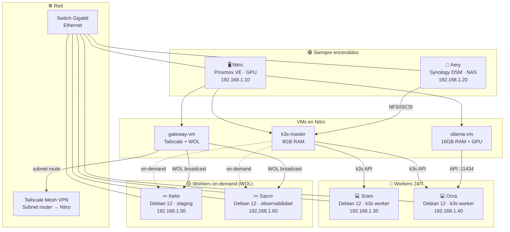
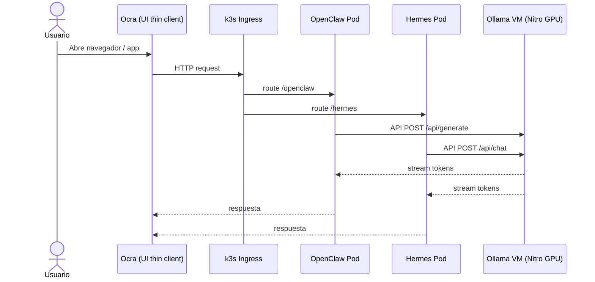
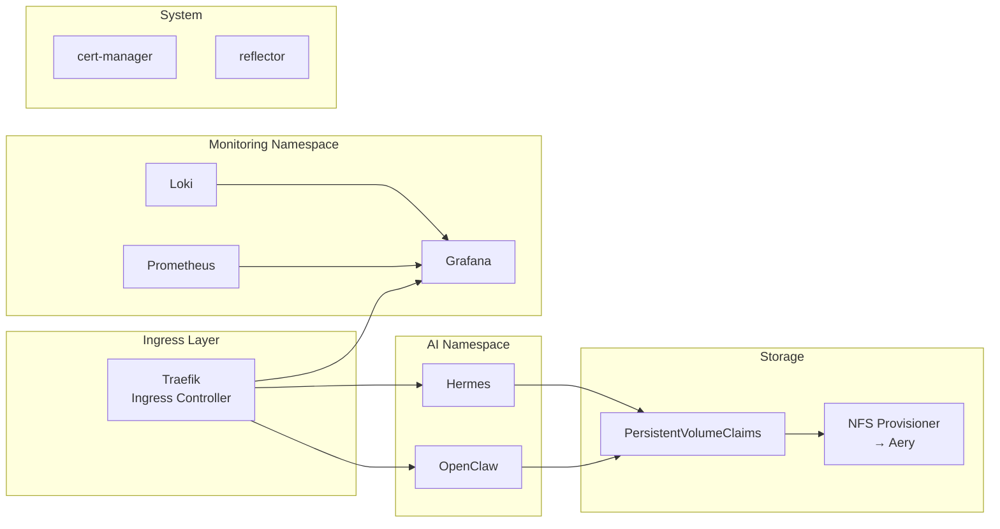
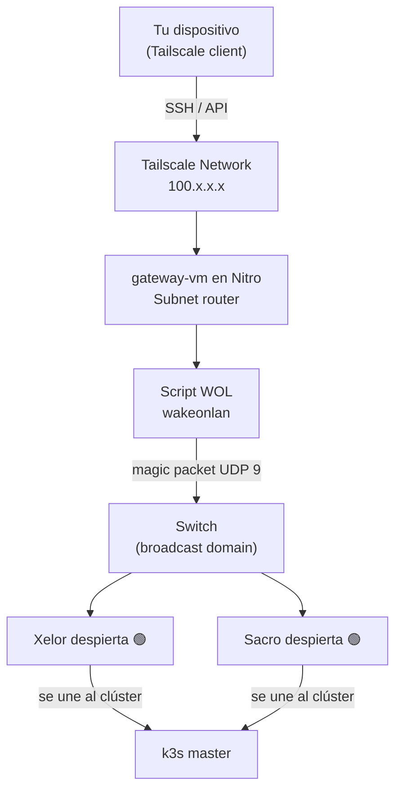

# 🏠 HomeLab Infrastructure

Infraestructura completa para un clúster doméstico de 6 nodos basado en **k3s**, **Proxmox VE**, **Tailscale** y **Wake-on-LAN**, con soporte para modelos de AI locales vía GPU.

---

## 📋 Tabla de contenidos

- [Nodos y roles](#nodos-y-roles)
- [Arquitectura de red](#arquitectura-de-red)
- [Diagramas](#diagramas)
- [Requisitos previos](#requisitos-previos)
- [Instalación rápida](#instalación-rápida)
- [Uso diario](#uso-diario)
- [Stack de servicios](#stack-de-servicios)
- [Estructura del proyecto](#estructura-del-proyecto)

---

## Nodos y roles

| Nodo | OS base | Rol | Disponibilidad |
|------|---------|-----|----------------|
| **Nitro** | Proxmox VE 8 | Hipervisor principal · k3s master VM · GPU passthrough para Ollama | 24/7 |
| **Aery** | Synology DSM | NAS · NFS/iSCSI persistent volumes · Backup | 24/7 |
| **Sram** | Debian 12 (bare metal) | k3s worker · entornos de desarrollo | 24/7 |
| **Ocra** | Debian 12 (bare metal) | k3s worker · thin client para AI (UI only) | 24/7 |
| **Xelor** | Debian 12 (bare metal) | k3s worker on-demand · staging · CI/CD | On-demand |
| **Sacro** | Debian 12 (bare metal) | k3s worker on-demand · observabilidad (Grafana / Loki) | On-demand |

### VMs dentro de Nitro (Proxmox)

| VM | vCPUs | RAM | Propósito |
|----|-------|-----|-----------|
| `nitro-k3s-master` | 4 | 8 GB | Nodo master del clúster k3s |
| `nitro-ollama` | 6 | 16 GB | Ollama + GPU passthrough — modelos locales |
| `nitro-gateway` | 2 | 4 GB | Tailscale subnet router + WOL relay |

---

## Arquitectura de red

```
Internet
   │
   └── Router doméstico (192.168.1.1)
          │
          └── Switch Ethernet (gigabit)
                 ├── Nitro      192.168.1.10  (+ VLAN mgmt)
                 ├── Aery       192.168.1.20
                 ├── Sram       192.168.1.30
                 ├── Ocra       192.168.1.40
                 ├── Xelor      192.168.1.50  (WOL MAC en config)
                 └── Sacro      192.168.1.60  (WOL MAC en config)
```

**VLANs recomendadas:**
- `VLAN 10` — management (SSH, Proxmox UI, Tailscale)
- `VLAN 20` — data (NFS, iSCSI, tráfico k3s interno)

---

## Diagramas

### Vista general de nodos



### Flujo de servicios AI



### Stack k3s



### Wake-on-LAN remoto



---

## Requisitos previos

- **Nitro:** Proxmox VE 8.x instalado, BIOS con VT-d habilitado para GPU passthrough
- **Aery:** Synology DSM con paquete NFS habilitado
- **Sram / Ocra / Xelor / Sacro:** Debian 12 instalado, usuario con sudo, SSH activo
- **Red:** Todos los nodos en el mismo broadcast domain (mismo switch)
- **WOL:** Habilitado en BIOS de Xelor y Sacro; NICs compatibles con magic packets
- **Tailscale:** Cuenta activa; auth key generado en `https://login.tailscale.com/admin/settings/keys`
- **Ansible:** `ansible >= 2.14` en tu máquina local
- **kubectl + helm:** Instalados en tu máquina local

---

## Instalación rápida

```bash
# 1. Clonar este repositorio
git clone <tu-repo> homelab && cd homelab

# 2. Copiar y editar el inventario con tus IPs y MACs
cp ansible/inventory/hosts.yml.example ansible/inventory/hosts.yml
$EDITOR ansible/inventory/hosts.yml

# 3. Configurar variables (Tailscale auth key, SSH keys, etc.)
cp ansible/inventory/group_vars/all.yml.example ansible/inventory/group_vars/all.yml
$EDITOR ansible/inventory/group_vars/all.yml

# 4. Bootstrap de todos los nodos (instala dependencias base)
ansible-playbook ansible/playbooks/bootstrap.yml

# 5. Configurar Proxmox y crear VMs en Nitro
ansible-playbook ansible/playbooks/proxmox.yml

# 6. Instalar k3s (master + workers)
ansible-playbook ansible/playbooks/k3s.yml

# 7. Aplicar manifests del clúster
kubectl apply -k k3s/manifests/

# 8. Verificar el clúster
kubectl get nodes -o wide
```

---

## Uso diario

### Despertar nodos on-demand

```bash
# Despertar Xelor
./scripts/wol/wake.sh xelor

# Despertar Sacro
./scripts/wol/wake.sh sacro

# Despertar todos los nodos on-demand
./scripts/wol/wake.sh all

# Ver estado de todos los nodos
./scripts/wol/status.sh
```

### Gestionar el clúster k3s

```bash
# Ver nodos
kubectl get nodes

# Ver pods de AI
kubectl get pods -n ai

# Escalar OpenClaw
kubectl scale deployment openclaw -n ai --replicas=2

# Ver logs de Ollama
kubectl logs -n ai deployment/ollama -f
```

### Añadir nodo al clúster manualmente

```bash
# En el nodo nuevo (ej: Xelor recién despertado)
./scripts/k3s/join-worker.sh xelor
```

---

## Stack de servicios

| Servicio | Namespace | Puerto externo | Descripción |
|----------|-----------|---------------|-------------|
| Traefik | kube-system | 80 / 443 | Ingress controller |
| OpenClaw | ai | /openclaw | Interfaz AI principal |
| Hermes | ai | /hermes | Asistente AI |
| Ollama | ai | :11434 (interno) | Motor de modelos locales |
| Prometheus | monitoring | /prometheus | Métricas del clúster |
| Grafana | monitoring | /grafana | Dashboards |
| Loki | monitoring | interno | Agregación de logs |

---

## Estructura del proyecto

```
homelab/
├── README.md                        ← Este archivo
├── ansible/
│   ├── inventory/
│   │   ├── hosts.yml                ← IPs, MACs, grupos de nodos
│   │   └── group_vars/
│   │       └── all.yml              ← Variables globales (tokens, keys)
│   ├── playbooks/
│   │   ├── bootstrap.yml            ← Setup base de todos los nodos
│   │   ├── proxmox.yml              ← Configuración de Nitro + VMs
│   │   └── k3s.yml                  ← Instalación del clúster
│   └── roles/
│       ├── common/                  ← Paquetes base, hardening SSH
│       ├── proxmox/                 ← Proxmox API + creación de VMs
│       ├── k3s-master/              ← Instalación nodo master
│       ├── k3s-worker/              ← Instalación nodos worker
│       ├── nas/                     ← Configuración NFS en Aery
│       └── wol/                     ← Configuración Wake-on-LAN
├── k3s/
│   ├── manifests/
│   │   ├── namespaces/              ← Namespaces del clúster
│   │   ├── storage/                 ← StorageClass NFS + PVCs
│   │   ├── ai/                      ← Deployments OpenClaw, Hermes, Ollama
│   │   ├── monitoring/              ← Prometheus, Grafana, Loki
│   │   └── ingress/                 ← IngressRoutes Traefik
│   └── helm/                        ← Values files para charts Helm
├── scripts/
│   ├── bootstrap/
│   │   └── node-init.sh             ← Script inicial para nodo Debian nuevo
│   ├── wol/
│   │   ├── wake.sh                  ← Enviar magic packet a un nodo
│   │   └── status.sh                ← Ping a todos los nodos
│   ├── k3s/
│   │   └── join-worker.sh           ← Unir worker al clúster
│   └── ai/
│       └── pull-models.sh           ← Descargar modelos en Ollama
└── docs/
    └── proxmox-gpu-passthrough.md   ← Guía GPU passthrough paso a paso
```

---

## Notas de seguridad

- Los secrets de Kubernetes se gestionan con **Sealed Secrets** (incluido en manifests)
- El archivo `ansible/inventory/group_vars/all.yml` **nunca se commitea** (ver `.gitignore`)
- Tailscale ACLs recomendadas: solo Nitro gateway-vm tiene acceso a la subred completa
- SSH en todos los nodos: autenticación solo por llave pública, root login deshabilitado

---

*Generado con ❤️ para un home lab eficiente.*
