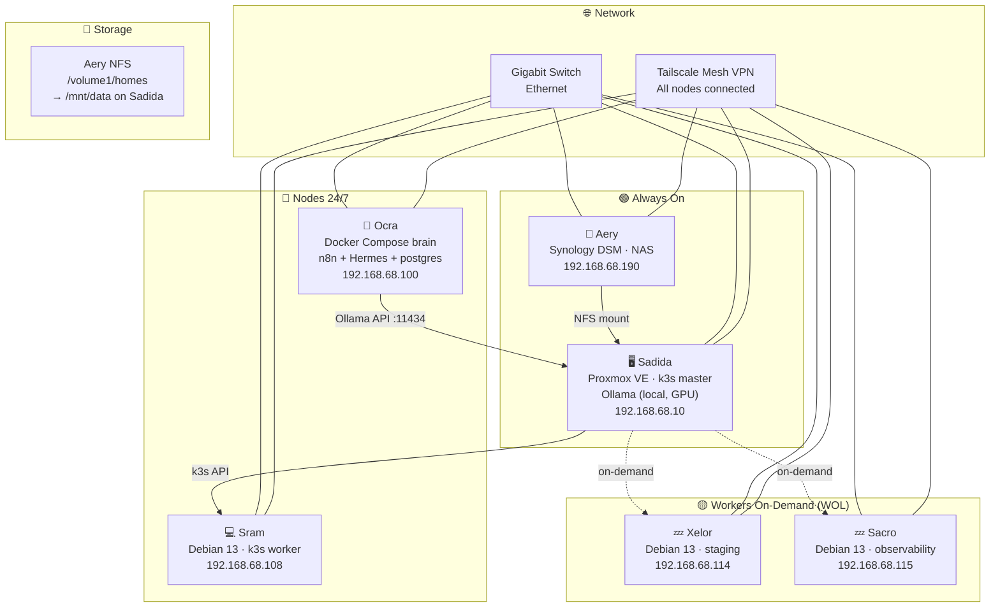
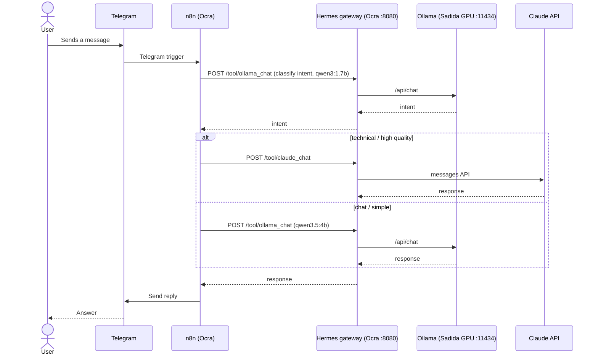
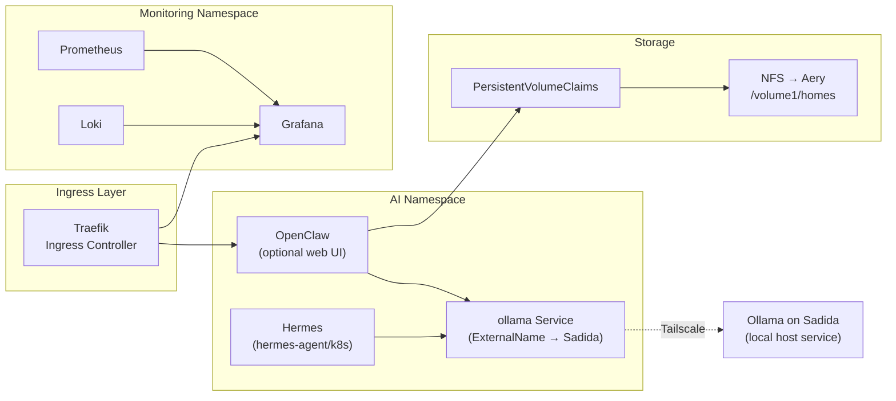
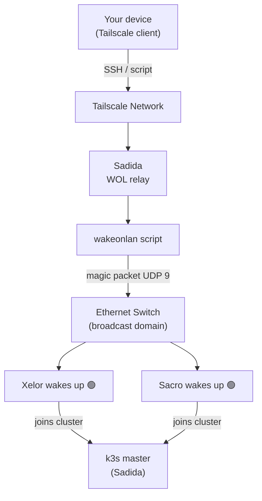

# HomeLab Infrastructure for High Availability

Complete infrastructure for a 6-node home cluster based on **k3s**, **Proxmox VE**, **Tailscale** and **Wake-on-LAN**, with a local AI agent stack backed by a GPU.

The AI layer follows a simple split: **Ollama runs locally on Sadida** (the only GPU node), and **Ocra is the 24/7 "brain"** running a Docker Compose stack (n8n + Hermes gateway + PostgreSQL + a Tailscale sidecar). Messages arrive over Telegram, n8n classifies intent, and Hermes routes each request to either the local Ollama model or the Claude API.

---

## Table of Contents

- [Nodes and Roles](#nodes-and-roles)
- [Network Architecture](#network-architecture)
- [AI Stack](#ai-stack)
- [Diagrams](#diagrams)
- [Prerequisites](#prerequisites)
- [Quick Start](#quick-start)
- [Daily Usage](#daily-usage)
- [Service Stack](#service-stack)
- [Project Structure](#project-structure)
- [Security Notes](#security-notes)

---

## Nodes and Roles

| Node | Base OS | Role | Availability |
|------|---------|------|--------------|
| **Sadida** | Proxmox VE 8 (Debian 13 Trixie kernel) | Hypervisor · k3s control-plane · **Ollama (local host service, GPU RTX 3050)** | 24/7 |
| **Aery** | Synology DSM | NAS · NFS persistent volumes (`/volume1/homes`) · Backup | 24/7 |
| **Sram** | Debian 13 Trixie (bare metal) | k3s worker · development environments (no GPU) | 24/7 |
| **Ocra** | Debian 13 Trixie (bare metal) | **Brain 24/7 — Docker Compose: n8n + Hermes gateway + PostgreSQL + Tailscale**; also a k3s worker | 24/7 |
| **Xelor** | Debian 13 Trixie (bare metal) | k3s worker on-demand · staging · CI/CD | On-demand |
| **Sacro** | Debian 13 Trixie (bare metal) | k3s worker on-demand · observability (Grafana / Loki) | On-demand |

### Node IPs

| Node | LAN IP | Role |
|------|--------|------|
| Sadida (Proxmox) | `192.168.68.10` | k3s control-plane · Ollama |
| Aery (Synology) | `192.168.68.190` | NFS server |
| Ocra | `192.168.68.100` | AI brain (Docker Compose) · k3s worker |
| Sram | `192.168.68.108` | k3s worker |
| Xelor | `192.168.68.114` | k3s worker (on-demand) |
| Sacro | `192.168.68.115` | k3s worker (on-demand) |

### k3s Cluster

The k3s control-plane runs directly on Sadida (Proxmox host), not inside a VM. Workers are bare-metal Debian 13 nodes joined via Tailscale IP for network resilience.

```
k3s v1.35.5+k3s1
Subnet: 192.168.68.0/24
Tailnet: stegosaurus-panga.ts.net (Tailscale MagicDNS)
```

---

## Network Architecture

```
Internet
   │
   └── Home Router (192.168.68.1)
          │
          └── Gigabit Ethernet Switch
                 ├── Sadida     192.168.68.10   (Proxmox + k3s master + Ollama)
                 ├── Aery       192.168.68.190  (Synology NAS)
                 ├── Ocra       192.168.68.100  (AI brain — Docker Compose)
                 ├── Sram       192.168.68.108  (k3s worker)
                 ├── Xelor      192.168.68.114  (k3s worker, on-demand)
                 └── Sacro      192.168.68.115  (k3s worker, on-demand)
```

**Tailscale mesh VPN** runs on all nodes, providing stable addressing independent of local network changes. Workers join the k3s cluster using Tailscale IPs so the cluster remains functional across network reconfigurations. Nodes reach each other by MagicDNS names such as `sadida.stegosaurus-panga.ts.net`.

**NFS mount on Sadida:**
```
192.168.68.190:/volume1/homes → /mnt/data
```
Mounted read-write via `/etc/fstab` with the `_netdev` flag; auto-mounts on reboot once the network is available.

---

## AI Stack

The AI stack is intentionally split between two nodes, and the primary deployment is Docker Compose (not Kubernetes):

**Ollama on Sadida (local, not a pod).** Sadida is the only node with a discrete GPU (RTX 3050), so Ollama runs as a local host service on port `11434`. Running it directly on the host avoids an unnecessary orchestration layer and gives the models direct GPU access. Two models are installed (see `scripts/ai/pull-models.sh`): `qwen3:1.7b` as the intent classifier and `qwen3.5:4b` as the main conversational agent.

**Ocra as the 24/7 brain.** Ocra runs the functional stack via Docker Compose (`n8n/docker-compose.yaml`): n8n (workflow orchestrator), the Hermes gateway, PostgreSQL (n8n's database), and a Tailscale sidecar. n8n and Hermes share the sidecar's network namespace, so n8n reaches Hermes at `http://localhost:8080`. All external calls (Claude, Telegram) originate here.

**Hermes as the router.** Hermes is a small HTTP gateway (`hermes-agent/mcp-server/gateway.js`) exposing tools over `POST /tool/:name`, plus `GET /health` and `GET /tools`. It decides between the local Ollama model and the Claude API depending on intent, and also exposes sandboxed filesystem and shell tools. It reaches Ollama on Sadida over Tailscale (`sadida.stegosaurus-panga.ts.net:11434`).

**Telegram as the interface.** A user sends a Telegram message → n8n receives it → n8n asks Hermes to classify intent → based on intent, n8n routes to Claude (high-quality/technical) or to Ollama (chat/simple) through Hermes → the response is sent back over Telegram.

Kubernetes is an **optional / future** route for Hermes. Its manifest lives in `hermes-agent/k8s/hermes-stack.yaml` and, like the Compose setup, treats Ollama as an external service on Sadida (via an `ExternalName` Service). See `hermes-agent/README.md` for details.

---

## Diagrams

### Node Overview



### AI Service Flow



### k3s Stack (optional / future route)



### Wake-on-LAN Flow



---

## Prerequisites

- **Sadida:** Proxmox VE 8.x installed, BIOS with VT-d enabled for GPU passthrough, `_netdev` NFS mount configured, Ollama installed as a local service with the two models pulled
- **Aery:** Synology DSM with NFS service enabled, `/volume1/homes` exported to `192.168.68.0/24` and `100.0.0.0/8`
- **Ocra:** Debian 13 Trixie, Docker + Docker Compose installed (this is where the AI brain runs)
- **Sram / Xelor / Sacro:** Debian 13 Trixie installed, user with sudo, SSH active
- **Network:** All nodes on the same broadcast domain (same switch)
- **WOL:** Enabled in BIOS on Xelor and Sacro; NICs compatible with magic packets
- **Tailscale:** Active account; auth key generated at `https://login.tailscale.com/admin/settings/keys`
- **Claude API:** Anthropic API key from `https://console.anthropic.com/settings/keys`
- **Ansible:** `ansible >= 2.14` on your local machine
- **kubectl + helm:** Installed on your local machine (for the optional k8s route)

---

## Quick Start

### 1. Provision the cluster (Ansible + k3s)

```bash
# Clone this repository
git clone <your-repo> homelab && cd homelab

# Copy and edit the inventory with your real IPs and MACs
cp ansible/inventory/hosts.yml.example ansible/inventory/hosts.yml
$EDITOR ansible/inventory/hosts.yml

# Configure variables (Tailscale auth key, SSH keys, etc.)
cp ansible/inventory/group_vars/all.yml.example ansible/inventory/group_vars/all.yml
$EDITOR ansible/inventory/group_vars/all.yml

# Bootstrap all nodes, configure Proxmox, install k3s
ansible-playbook ansible/playbooks/bootstrap.yml
ansible-playbook ansible/playbooks/proxmox.yml
ansible-playbook ansible/playbooks/k3s.yml

# (Optional) apply cluster manifests and verify
kubectl apply -k k3s/manifests/
kubectl get nodes -o wide
```

### 2. Pull the AI models on Sadida

```bash
# Ollama runs locally on Sadida; pull the two models the stack expects
./scripts/ai/pull-models.sh          # qwen3:1.7b + qwen3.5:4b
./scripts/ai/pull-models.sh list     # show what is installed
```

### 3. Launch the AI brain on Ocra (Docker Compose)

```bash
cd n8n
cp .env.example .env      # fill in TS_AUTHKEY, ANTHROPIC_API_KEY, POSTGRES_PASSWORD, N8N_ENCRYPTION_KEY
sudo docker compose up -d --build   # --build builds the Hermes image from ../hermes-agent/mcp-server

# Verify
sudo docker compose ps
sudo docker exec n8n_core wget -qO- http://localhost:8080/health   # Hermes responds
curl -s http://sadida.stegosaurus-panga.ts.net:11434/api/tags      # Ollama reachable
```

Then open the n8n UI at `https://ocra.stegosaurus-panga.ts.net/`, configure the Telegram credential (the bot token lives in n8n, not in `.env`), import `n8n/cerebro_workflow_v2.json`, and activate the workflow.

---

## Daily Usage

### Wake / power down on-demand nodes

```bash
./scripts/wol/wake.sh xelor        # Wake Xelor
./scripts/wol/wake.sh all          # Wake all workers
./scripts/wol/status.sh            # Status of all nodes + Ollama
./scripts/wol/shutdown.sh xelor    # Drain from k3s and power off
```

### Manage the AI brain on Ocra

```bash
cd n8n
sudo docker compose ps                 # container status
sudo docker compose logs -f n8n        # follow n8n logs
sudo docker compose logs -f hermes-gateway
sudo docker compose restart hermes-gateway
sudo docker compose up -d --build      # rebuild after editing Hermes code
```

### Manage the k3s cluster

```bash
kubectl get nodes -o wide
kubectl get pods -n ai                 # optional AI namespace (OpenClaw, etc.)
./scripts/k3s/join-worker.sh xelor     # join a worker manually after WOL
```

### Mount Aery NFS manually (if needed)

```bash
mount /mnt/data
# or force remount of all fstab entries:
mount -a
```

---

## Service Stack

### Ocra — Docker Compose (primary AI stack)

| Service | Container | Port | Description |
|---------|-----------|------|-------------|
| n8n | `n8n_core` | 5678 (via Tailscale sidecar) | Workflow orchestrator, Telegram trigger |
| Hermes gateway | `hermes_gateway` | 8080 (internal) | Routes to Ollama / Claude, sandboxed tools |
| PostgreSQL | `n8n_postgres` | 5432 (internal) | n8n database |
| Tailscale | `n8n_tailscale` | — | Sidecar; publishes n8n UI on the tailnet |

### Sadida — local host service

| Service | Port | Description |
|---------|------|-------------|
| Ollama | 11434 | Local LLM engine (GPU); `qwen3:1.7b`, `qwen3.5:4b` |

### k3s cluster (optional / future)

| Service | Namespace | External path | Description |
|---------|-----------|---------------|-------------|
| Traefik | kube-system | 80 / 443 | Ingress controller |
| OpenClaw | ai | /openclaw | Optional chat web UI |
| ollama (ExternalName) | ai | :11434 (internal) | Points to Ollama on Sadida |
| Hermes | ai | internal | Optional k8s deployment (`hermes-agent/k8s`) |
| Prometheus | monitoring | /prometheus | Cluster metrics |
| Grafana | monitoring | /grafana | Dashboards |
| Loki | monitoring | internal | Log aggregation |
| Portainer | portainer | :30777 | Cluster management UI (see `PORTAINER.md`) |

---

## Project Structure

```
homelab/
├── README.md                        ← This file
├── PORTAINER.md                     ← Portainer install guide (cluster UI)
├── ansible/
│   ├── inventory/
│   │   ├── hosts.yml.example        ← IPs, MACs, node groups
│   │   └── group_vars/
│   │       └── all.yml.example      ← Global variables (tokens, keys)
│   ├── playbooks/
│   │   ├── bootstrap.yml            ← Base setup for all nodes
│   │   ├── proxmox.yml              ← Proxmox configuration on Sadida
│   │   └── k3s.yml                  ← Cluster installation
│   └── roles/
│       └── common/                  ← Base packages, SSH hardening
├── n8n/                             ← PRIMARY AI stack (Docker Compose on Ocra)
│   ├── docker-compose.yaml          ← n8n + Hermes + postgres + tailscale
│   ├── .env.example                 ← Env template (copy to .env)
│   └── cerebro_workflow_v2.json     ← n8n Telegram → Hermes routing workflow
├── hermes-agent/                    ← Hermes gateway (agent brain)
│   ├── README.md                    ← Hermes architecture + deployment
│   ├── mcp-server/
│   │   ├── gateway.js               ← HTTP gateway on :8080 (used by n8n)
│   │   ├── server.js                ← Native MCP server over stdio (optional)
│   │   ├── Dockerfile               ← Node 20 Alpine image
│   │   └── package.json
│   ├── k8s/
│   │   └── hermes-stack.yaml         ← Optional k8s deployment (Hermes only)
│   └── scripts/
│       └── deploy.sh                ← Optional k8s deploy helper
├── k3s/
│   └── manifests/
│       ├── namespaces/              ← Cluster namespaces (ai, monitoring, storage)
│       ├── storage/                 ← NFS StorageClass + PVCs
│       ├── ai/                      ← ollama ExternalName + optional OpenClaw
│       ├── monitoring/              ← Prometheus, Grafana, Loki
│       └── ingress/                 ← Traefik IngressRoutes
├── scripts/
│   ├── bootstrap/
│   │   └── node-init.sh             ← First-boot script for a fresh Debian node
│   ├── wol/
│   │   ├── wake.sh                  ← Send magic packet to a node
│   │   ├── shutdown.sh              ← Drain from k3s and power off
│   │   └── status.sh                ← Node status + Ollama models
│   ├── k3s/
│   │   └── join-worker.sh           ← Join a worker to the cluster
│   └── ai/
│       └── pull-models.sh           ← Pull models into Ollama on Sadida
└── docs/
    └── proxmox-gpu-passthrough.md   ← GPU passthrough step-by-step guide
```

---

## Security Notes

- Secrets for the Ocra stack live in `n8n/.env`, which is **never committed** (see `.gitignore`). The Telegram bot token is stored inside n8n, not in `.env`.
- The `N8N_ENCRYPTION_KEY` must **not** be rotated on an existing install — doing so loses access to credentials already saved in n8n.
- Hermes runs sandboxed: non-root (UID 1001), all kernel capabilities dropped, a shell allowlist, and writes only to `/workspace/output`.
- Kubernetes secrets (optional route) are managed with **Sealed Secrets**.
- `ansible/inventory/group_vars/all.yml` is **never committed**.
- Recommended Tailscale ACLs: only Sadida has access to the full subnet route.
- SSH on all nodes: public key authentication only, root login disabled.
- NFS export is restricted to `192.168.68.0/24` and `100.0.0.0/8` (Tailscale range).
